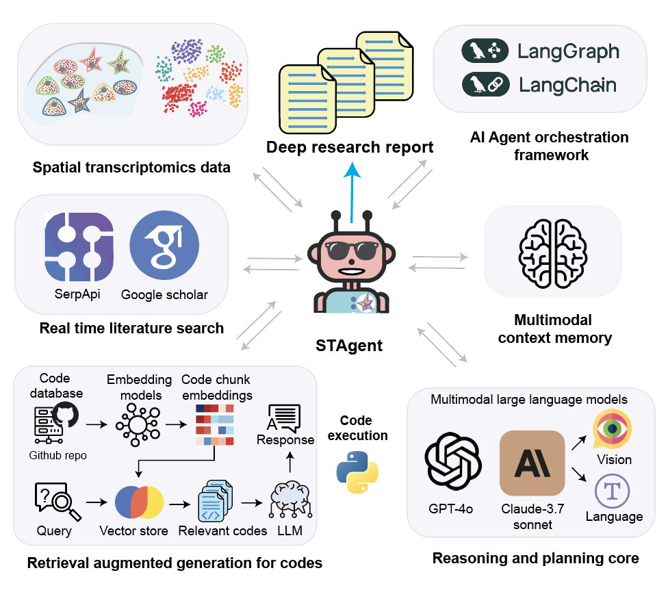

# STAgent

[](https://github.com/LiuLab-Bioelectronics-Harvard/STAgent/stargazers)
[](https://opensource.org/licenses/MIT)

https://doi.org/10.1101/2025.04.01.646731


## Overview
**STAgent** is a Streamlit-based spatial transcriptomics AI agent for interactive analysis of `.h5ad` datasets. This reviewer-facing package bundles the main application, tool definitions, prompt/configuration logic, and optional external-tool workflows used for STAligner-based spatial domain identification and Tangram-based gene imputation.

This clean package is organized to preserve the current app behavior while making installation and review substantially easier than the full development export.




## Features

### End-to-End Automation
Guides spatial transcriptomics analysis from data input to final interpretation in a single workflow. STAgent helps organize preprocessing, analysis, visualization, and report generation so researchers can move from raw data to biological insight more efficiently.

### Flexible Pipeline
Supports a range of analysis needs, from standard exploratory workflows to more specialized tasks to generate dataset or user query-specific pipelines. Researchers can use the core pipeline directly or extend it with optional modules for applications such as cross-sample alignment, gene imputation, and customized downstream analysis.

### Multimodal Interaction
Supports text, voice, and image-based inputs, making it easier for researchers to explore datasets in the way that feels most natural. Users can ask questions in plain language without needing advanced programming experience.

### Autonomous Reasoning
Combines tissue images, spatial gene expression patterns, and user questions to help carry out analysis steps and interpret results. This allows the system to assist with both computational tasks and biological reasoning during data exploration.

### Conflict Checking
Reviews intermediate conclusions against the broader analysis context and supporting evidence to identify claims that may be inconsistent, uncertain, or overstated. This helps improve the reliability of the final interpretation and encourages more careful biological reasoning.

### Deeper Research Support
Connects analysis results with relevant literature to provide broader biological context for observed patterns. This helps researchers relate spatial findings to known pathways, cell states, tissue organization, and disease mechanisms.

### Interpretable Results
Produces organized, readable summaries of the analysis, including methods, main findings, and possible biological implications. The outputs are designed to help researchers quickly understand results and communicate them to collaborators.

### Context-Aware Gene Analysis
Highlights genes and pathways in the context of the tissue, condition, and spatial patterns being studied. This helps prioritize signals that are more likely to be biologically meaningful rather than relying on statistics alone.

### Visual Reasoning Engine
Examines spatial maps and tissue organization to identify regions, boundaries, gradients, and other structural patterns. This can help reveal biologically relevant changes across samples, timepoints, or conditions.

### Scalable Knowledge Synthesis
Brings together analysis results into a coherent biological story that can support hypothesis generation. STAgent helps connect observed spatial patterns with processes such as cell-cell communication, tissue organization, development, and disease.


## Package Contents

- `src/`: main Streamlit app, provider routing, prompts, tool implementations, conflict logging, and report generation.
- `packages_available/STAligner/`: vendored local STAligner package used by the optional external workflow.
- `packages_available/open_deep_research/`: vendored deeper-research module used for literature synthesis and report context generation.
- `environment.yml`: main environment for the Streamlit app and core in-process analysis tools.
- `environment.gpu.yml`: optional heavier environment for the external STAligner and Tangram workflows.
- `conversation_histories/`, `research_reports/`, `output_report/`, `src/tmp/plots/`: runtime outputs generated during use.


## Installation

Run all commands from the package root:

```bash
cd STAgent_clean
```

Create the main application environment:

```bash
conda env create -f environment.yml
conda activate STAgent
```

If you also want the optional external workflows for STAligner or Tangram, create the secondary environment.

```bash
conda env create -f environment.gpu.yml
conda activate STAgent_gpusub
```

Then point the app to that interpreter when needed:

```bash
export STAGENT_GPU_PYTHON_BIN="conda run -n STAgent_gpusub_test python"
```

Notes:

- If you also want the optional external workflows for STAligner or Tangram, create the secondary environment, please make sure to check your hardware compatibility about gpu, especially the cuda and torch version. For details, refer to https://pytorch.org/get-started/locally/:
- PyTorch Geometric or GPU acceleration may still require platform-specific follow-up installation, please refer to https://pytorch-geometric.readthedocs.io/en/latest/install/installation.html, and https://github.com/pyg-team/pytorch_geometric?tab=readme-ov-file.

## Required and Optional Environment Variables

The app loads environment variables from `src/.env` if present.

Create it safely from the checked-in example template:

```bash
cp src/.env.example src/.env
```

Then update only the entries you need. The local `src/.env` file is gitignored and should not be committed. See `src/.env.example` for the full list of supported variables.

At minimum, set one provider key for the model family you want to use:

- `OPENAI_API_KEY`
- `ANTHROPIC_API_KEY`
- `GOOGLE_API_KEY`
- `SERP_API_KEY`: enables Google Scholar retrieval through SerpAPI.

Optional integrations:

- `WHISPER_API_KEY`: enables voice transcription.
- `ODR_SEARCH_API`: deeper-research search backend override (`serp`, `openai`, `anthropic`, or `none`).
- `STAGENT_GPU_PYTHON_BIN`: external interpreter command for STAligner/Tangram workflows.
- `STAGENT_GPU_TOOL_CWD`: optional working directory for external-tool execution.

Important: Make sure your API accounts have sufficient balance or credits available, otherwise the agent may not function properly.


## Running the App

Start the Streamlit interface with the main environment active:

```bash
streamlit run src/unified_app.py
```

Download the .h5ad data files from [Google Drive](https://drive.google.com/drive/folders/1RqWGBhCia06-vQnqHUnid63MybQIKwFJ) and place them in the `./data` directory.

## Data and Outputs

- The default configured dataset path is `data/pancreas_processed_full.h5ad` in `src/config.py`.
- Users can also provide alternative `.h5ad` paths directly in the chat workflow.
- Generated plots are saved under `src/tmp/plots/`.
- Conversation histories are saved under `conversation_histories/`.
- Deeper-research outputs are saved under `research_reports/`.
- Final reports are saved under `output_report/`.

## Demo

Check out our [demo video](https://www.youtube.com/watch?v=aEUop05RINY&t=2s) to see STAgent in action.

## Citation
If you use STAgent in your research, please cite:
> *Lin, Z., *Wang, W., et al. Spatial transcriptomics AI agent charts hPSC-pancreas maturation in vivo. (2025). _bioRxiv_.
> https://doi.org/10.1101/2025.04.01.646731

## License
This project is licensed under the MIT License - see the [LICENSE](LICENSE) file for details.


## Acknowledgement
- STAligner package is a fork from https://github.com/zhoux85/STAligner
- Deeper research module is refactoried from https://github.com/langchain-ai/open_deep_research
